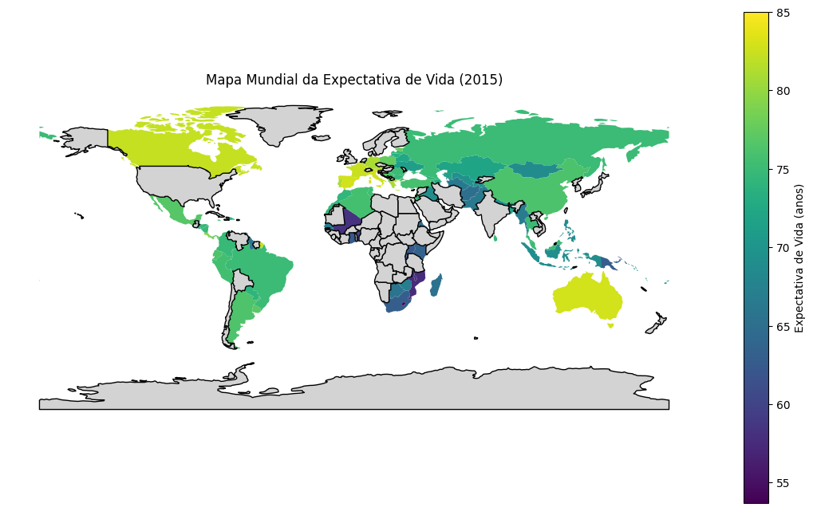
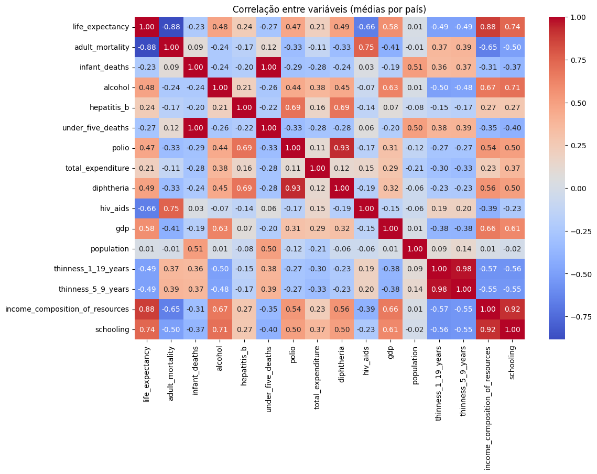
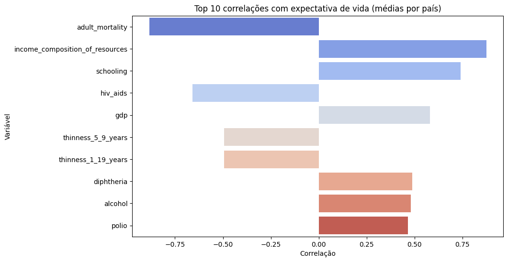

# 🌍 Análise de Expectativa de Vida (EDA)

[](./notebooks/Expectativa_vida.ipynb)

Este projeto realiza uma **Análise Exploratória de Dados (EDA)** sobre expectativa de vida em diferentes países, utilizando dados provenientes da **Organização Mundial da Saúde (WHO)** e disponibilizados no site [Kaggle](https://www.kaggle.com/datasets/kumarajarshi/life-expectancy-who/data). 
O foco está em limpeza, padronização e exploração dos dados como fatores demográficos, econômicos e de saúde pública que influenciam a expectativa de vida.

---

## 📚 Índice
1. [Principais Resultados e Insights da EDA](#-principais-resultados-e-insights-da-eda)
2. [Objetivos do Estudo](#-objetivos-do-estudo)
3. [Abordagem Analítica](#-abordagem-analítica)
4. [Desafios Analíticos Superados](#-desafios-analíticos-superados)
5. [Visualizações Principais](#-visualizações-principais)
6. [Dicionário de Dados](#-dicionário-de-dados)
7. [Tecnologias Utilizadas](#-tecnologias-utilizadas)
8. [Estrutura do Repositório](#-estrutura-do-repositório)
9. [Status do Projeto e Próximos Passos](#-status-do-projeto-e-próximos-passos)

---
## 🗂 Estrutura do Repositório

```text
life_expectancy_eda/
│
├── notebooks/
│   └── Expectativa_vida.ipynb # Análise exploratória e tratamento dos dados
│
├── data/
│   ├── raw/
│   │   └── Life Expectancy Data.csv # Dataset original, com dados brutos
│   │
│   └── processed/
│       └── life_expectancy_final.csv # Dataset com dados tratados
│
│── figures/ # Imagens produzidas pelas análises
│   ├── mapa_expectancy.png # Mapa da distribuição da expectativa de vida pelo mundo
│   │
│   ├── heatmap_variaveis.png # Mapa de calor das correlações entre as variáveis 
│   │
│   └── top_variaveis_le.png # Gráfico de barras com maiores correlações de variáveis preditoras com expectativa de vida
│
├── LICENSE # Licença MIT
├── README.md # Instruções e dados do projeto
└── requirements.txt # Dependências do projeto
```
---

## 💡 Principais Resultados e Insights da EDA

* **Preditor Mais Forte:** A variável **`income_composition_of_resources`** (Composição da Renda) demonstrou ser o preditor mais forte para a Expectativa de Vida, com alta correlação positiva.
* **Importância da Educação:** A variável **`schooling`** (Anos de Escolaridade) segue de perto em termos de correlação positiva, reforçando o impacto direto dos fatores educacionais na longevidade.
* **Fatores Críticos de Saúde:** As variáveis **`adult_mortality`** e **`hiv/aids`** apresentam as correlações mais fortes e negativas, sendo as áreas críticas de saúde pública que inibem o aumento da Expectativa de Vida.

### 📌 Outros Resultados

O estudo identificou:

- Presença relevante de dados ausentes em variáveis-chave.
- Disparidade significativa entre países com dados completos e incompletos.
- Correlação entre investimento em saúde e expectativa de vida.
- Grande número de dados errados.

---

## 🎯 Objetivos

1. Avaliar a qualidade e completude do dataset.
2. Padronizar variáveis e nomes de colunas para melhor manipulação.
3. Tratar valores ausentes e inconsistentes com técnicas adequadas.
4. Explorar correlações entre fatores socioeconômicos e expectativa de vida.
5. Preparar uma base confiável para análises futuras e modelos preditivos.

---
## 🚀 Instruções de Instalação

Para reproduzir este projeto localmente, siga os passos abaixo:

```bash
# Clone o repositório
git clone https://github.com/PauloVBernardo/life_expectancy_eda.git
cd life_expectancy_eda

# Crie o ambiente virtual
python -m venv venv
source venv/bin/activate   # Linux/Mac
venv\Scripts\activate      # Windows

# Instale dependências principais
pip install -r requirements.txt

# Abra o Notebook
jupyter notebook notebooks/Expectativa_vida.ipynb
```
---

## 🔍 Abordagem Analítica

### Metodologia de Limpeza e Tratamento

Foram conduzidas as seguintes etapas:

- Avaliação da completude dos dados.
- Detecção e tratamento de valores ausentes e incongruentes:
    * Variáveis contínuas: imputação pela média.
    * Remoção de colunas com >30% de dados nulos e incongruentes.
    * Remoção de países com dados >30% de dados nulos e incongruentes.
    * Remoção de países com série histórica incompleta (< 16 anos).
- Análise estatística descritiva.
- Padronização de variáveis.
- Visualizações exploratórias (correlações, mapas e gráficos).
- Tratameno de *warnings* (NumPy e Seaborn).

### Metas de Qualidade de Dados (Resumo)

1. **Padronização de Colunas:** Renomear colunas complexas para o formato `snake_case`.
2. **Imputação Estratégica:** Garantir um *dataset* **100% completo** (zero valores nulos) e livre de duplicatas.
3. **Decisão Técnica:** Nulos foram imputados utilizando a **Média** (`.mean()`).

---

## 🔎 Desafios Analíticos Superados

A fase de limpeza e visualização exigiu decisões técnicas complexas para a resolução de problemas:

1. **Tratamento da Série Temporal:** O *dataset* contém 16 anos de dados para cada país. 
Para a **Visualização Geográfica (Mapa Coroplético)**, foi necessário filtrar o DataFrame para o **último ano disponível**, fornecendo um *snapshot* geográfico relevante.
2. **Incompatibilidade de Nomes Geográficos:** A criação do mapa foi dificultada pela **incompatibilidade dos nomes de países** entre o DataFrame do projeto e o *shapefile* geográfico padrão.
    * **Solução:** O desafio foi superado através da criação e implementação de um **dicionário de mapeamento manual** para renomear e alinhar os países, e posterior filtragem dos países não representados no *shapefile*.
3. **Dados problemáticos:** O *dataset* continha um grande número de dados incongruentes (fora dos limites esperados para a variável)e dados nulos. 
Foi necessário avaliar alguns casos isolados e determinar onde seria possível aplicar uma correção e onde era necessário realizar uma exclusão.
---

## 📊 Principais Visualizações 


1. Mapa coroplético da expectativa de vida por país



2. Heatmap das correlações entre variáveis


3. Variávies com maiores relações com Expectativa de Vida


---

## 📑 Dicionário de Dados

| Variável                        | Nome original no dataset | Descrição                                                                 | Unidade / Escala |
|---------------------------------|--------------------------|---------------------------------------------------------------------------|------------------|
| `country`                       | Country                  | País                                                                      | Texto            |
| `year`                          | Year                     | Ano da observação (2000–2015)                                             | Numérico         |
| `status`                        | Status                   | Status de desenvolvimento do país                                         | Texto            |
| `life_expectancy`               | Life expectancy          | Expectativa de vida ao nascer                                             | Anos             |
| `adult_mortality`               | Adult Mortality          | Probabilidade de morrer entre 15–60 anos por 1000 habitantes              | Taxa (por 1000)  |
| `infant_deaths`                 | Infant deaths            | Mortes de crianças menores de 1 ano por 1000 habitantes                   | Contagem         |
| `alcohol`                       | Alcohol                  | Consumo de álcool per capita (≥15 anos), litros de álcool puro            | Litros           |
| `percentage_expenditure`        | Percentage expenditure   | Despesa com saúde como % do PIB per capita                                | Percentual (%)   |
| `hepatitis_b`                   | Hepatitis B              | Cobertura de imunização contra Hepatite B em crianças de 1 ano            | Percentual (%)   |
| `measles`                       | Measles                  | Casos de sarampo notificados por 1000 habitantes                          | Contagem         |
| `bmi`                           | BMI                      | Índice de Massa Corporal médio da população adulta                        | Índice (kg/m²)   |
| `under_five_deaths`             | Under-five deaths        | Mortes de crianças menores de 5 anos por 1000 habitantes                  | Contagem         |
| `polio`                         | Polio                    | Cobertura de imunização contra Poliomielite                               | Percentual (%)   |
| `total_expenditure`             | Total expenditure        | Despesa total com saúde (% do PIB)                                        | Percentual (%)   |
| `diphtheria`                    | Diphtheria               | Cobertura de imunização contra Difteria                                   | Percentual (%)   |
| `hiv_aids`                      | HIV/AIDS                 | Casos reportados de HIV/AIDS                                              | Taxa/Contagem    |
| `gdp`                           | GDP                      | Produto Interno Bruto per capita                                          | USD              |
| `population`                    | Population               | População total do país                                                   | Contagem         |
| `thinness_1_19_years`           | Thinness 1-19 years      | Prevalência de magreza entre jovens de 1–19 anos                          | Percentual (%)   |
| `thinness_5_9_years`            | Thinness 5-9 years       | Prevalência de magreza entre crianças de 5–9 anos                         | Percentual (%)   |
| `income_composition_of_resources` | Income composition of resources | Índice de composição de renda (proxy para IDH)                     | Escala 0–1       |
| `schooling`                     | Schooling                | Média de anos de escolaridade da população                                | Anos             |


---
## 🛠 Tecnologias Utilizadas

- Python
- Pandas / NumPy (manipulação e análise de dados)
- Matplotlib / Seaborn (visualizações)
- SciPy (testes estatísticos)
- GeoPandas (mapas geográficos)

---

## ✅ Status do Projeto e Próximos Passos
Status Finalizado: fase exploratória e preparação de dados. 

Pronto para servir como base em análises preditivas futuras.

## ➡️ Próximos Passos (Continuidade do Projeto)
Esta limpeza de dados bem-sucedida estabelece a base para as próximas etapas:

	* Modelagem Preditiva.
	* Engenharia de Atributos.
	* Criação de Dashboards.
	
📬 Contato
👤 Autor: Paulo Vitor dos Santos Bernardo
📧 Email: pauloviti@gmail.com
🔗 LinkedIn: www.linkedin.com/in/paulo-vitor-bernardo